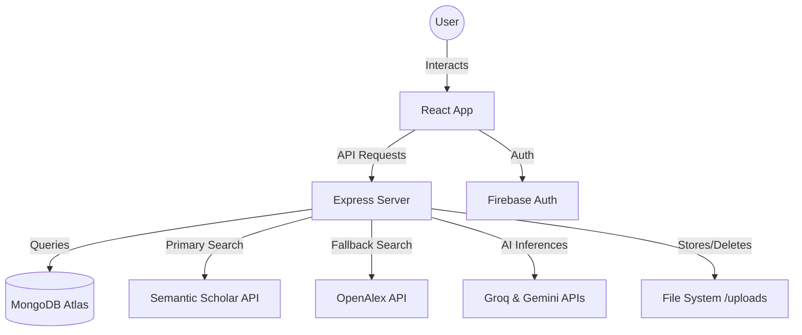
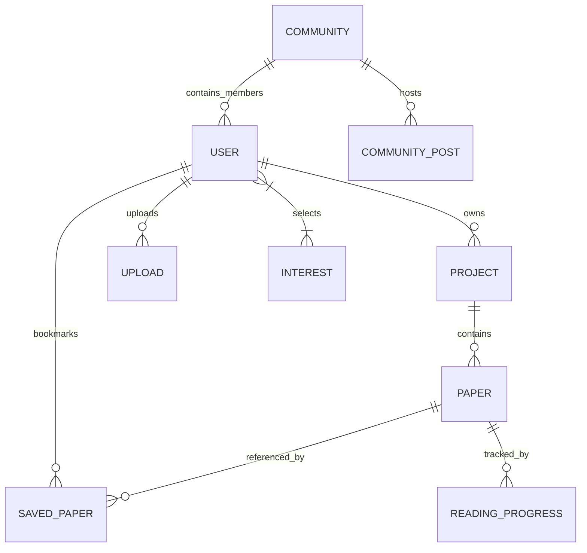

# Abstracts: AI-Powered Research Discovery 

Abstracts is a comprehensive web application designed for students and researchers to discover, organize, and discuss academic papers. It leverages AI-augmented workflows, multi-tenant caching, and personalized feeds to streamline every stage of research.

---

## 🛠 Technology Stack

### Frontend
- **React 18**: Core UI library with hooks-based state management.
- **Vite**: Ultra-fast build tool and dev server.
- **Tailwind CSS**: Utility-first styling with modern aesthetics.
- **Lucide React**: Clean and consistent iconography.
- **Framer Motion**: Smooth animations and micro-interactions.
- **Radix UI**: Primitive components for accessible UI elements (Progress, Badge, etc.).

### Backend
- **Node.js & Express**: High-performance server environment.
- **MongoDB Atlas**: Scalable NoSQL database for flexible data modeling.
- **Mongoose**: Elegant object modeling for Node.js.
- **JWT & BcryptJS**: Secure authentication and password hashing.
- **Multer & SVG Sanitizer**: Handling multipart form data and safe file uploads.
- **Groq SDK & Google Generative AI**: Fast AI paper recommendations and contextual chat reasoning.
- **Firebase Admin SDK**: Google Sign-In authentication integration.

---

## 📐 Project Architecture

### System Workflow


### Database Schema
The database is structured around the core entities of the research workflow:



### User Schema (updated)
```javascript
// server/models/index.js
const UserSchema = new mongoose.Schema({
  name:                 String,
  email:                { type: String, unique: true },
  passwordHash:         String,
  role:                 String,
  interests:            [String],        // up to 4 selected research domains
  hasSelectedInterests: { type: Boolean, default: false },
  // ...stats, avatar, etc.
});
```

---

## ✨ Core Features

### 1. Paper Discovery & Staged Filtering
Users can search millions of papers via the **Semantic Scholar API** integration with automatic **OpenAlex API** fallback for high availability.
- **Staged Filter Selection**: `SearchFilter` allows filtering by author and publication year. Filters are staged locally and applied explicitly via an **Apply Filters** button to avoid triggering excessive API calls.
- **Request Cancellation Guard**: Implements `AbortController` in search workflows to cancel outdated requests during fast query changes.

### 2. Research Library & Projects
- **Library**: Centralized view of all imported and saved papers with sort/search.
- **Projects**: Specialized workspaces to group papers by topic (e.g., "Deep Learning", "Bioinformatics").
- **Visual Feedback**: Project paper selection modals render green **"Added ✓"** badges for papers already in a project, providing immediate visual feedback.
- **Reading Progress**: Track exactly how much of a paper has been read.

### 3. 🗞 For You — Personalized Feed
A dedicated **"For You"** page that automatically fetches the latest papers for each of the user's selected research interests:
- Horizontally scrollable card rows, one per interest domain.
- Papers fetched in parallel from Semantic Scholar on page mount.
- **Import** button to save directly to personal library; **Open** button to read the source.
- "See all →" button navigates to Discover with the interest pre-filled.
- **Refresh** re-fetches all feeds on demand.
- Empty state guides new users to set interests via Settings.

### 4. 🔬 Research Interests Onboarding
New users are prompted with an **Interests Selection Modal** on first login:
- **71 research domains** spanning Tech, Biology, Medicine, Environment, Social Sciences, Economics, Humanities.
- Each domain has a **contextual Unsplash image** background.
- **Max 4 selections** enforced — visual warning when limit is reached.
- **Custom domain input** — if a user's field isn't listed, they can add it manually.
- Interests are saved to the user profile and used to drive the For You feed.
- Accessible from **Settings → Research Interests** to update at any time.

### 5. AI Chat Assistant & Reasoning Engine
A persistent sidebar powered by Groq SDK and Gemini for summarizing abstracts, explaining complex concepts, or generating citations:
- Customizable temperature controls governing AI response determinism.
- Enhanced reasoning prompts for domain-tailored research paper recommendations.
- Dynamic online status indicator showing AI service connectivity.

### 6. Community Collaboration
Discussion forums (Communities) divided by research subjects where users can post insights and attach papers for peer review.

### 7. User Behavior Analytics
Integrated Firebase Analytics to automatically track user behavior and engagement metrics without needing a complex backend logging system:
- **Search Tracking**: Records search terms within the library discovery to generate "Top Search Terms" insights.
- **Community Growth**: Logs when new communities are established to track engagement over time.
- **User Segmentation**: Differentiates events logged by authenticated researchers versus guests by assigning Firebase User IDs during authentication state changes.

---

## 🛡️ Security Measures

### 1. Global HTTP Header Protection (Helmet)
- **What**: Sets 11 essential HTTP security headers for every server response.
- **Why**: Protects the application from common web vulnerabilities at the browser level, such as Clickjacking, MIME-Sniffing, and Information Leakage.
- **How**: Added the `helmet` package as a global middleware in `server/index.js`.
- **Example**: Strips the `X-Powered-By: Express` header so automated bots cannot easily profile the server stack. It also sets `X-Frame-Options` to prevent malicious sites from invisibly embedding the app in an `iframe` to trick users into clicking hidden buttons.

### 2. Input Sanitization (XSS Prevention)
- **What**: Cleans up and neutralizes malicious HTML or JavaScript tags from user-submitted text.
- **Why**: Prevents Cross-Site Scripting (XSS) attacks where an attacker injects malicious code into the database, which would otherwise execute on other users' browsers.
- **How**: Integrated the `xss` library in `server/controllers/communityController.js` to sanitize the `content` field before saving it.
- **Example**: If an attacker submits a community post containing `<script>alert('hacked')</script>`, the `xss` library neutralizes it. The script is rendered harmlessly and won't execute when someone else views the community feed.

### 3. Spam & DoS Protection (Community Rate Limiting)
- **What**: Restricts the number of API requests a single IP address can make to the community chat within a given timeframe.
- **Why**: Prevents bad actors from spamming the database with fake content or causing a localized Denial of Service (DoS) by overwhelming the server.
- **How**: Configured `express-rate-limit` and applied it to the `POST /api/community/:id/posts` route in `server/routes/community.js` (max 5 requests per minute).
- **Example**: A script tries to blast 1,000 spam messages into a community chat. The rate limiter allows the first 5 and then automatically blocks all subsequent requests from that IP.

### 4. Brute-Force Password Protection (Auth Rate Limiting)
- **What**: Limits the number of login/registration attempts a single IP address can make.
- **Why**: Neutralizes brute-force or dictionary attacks where a script repeatedly attempts to guess user passwords.
- **How**: Implemented `authRateLimiter` using `express-rate-limit` on the `/login` and `/register` endpoints in `server/routes/auth.js` (max 5 attempts per 15 minutes).
- **Example**: If a hacker tries 5 incorrect passwords, their IP is completely blocked from the authentication endpoint for 15 minutes, making password guessing impossible.

### 5. Authentication & Session Security (JWT & Bcrypt)
- **What**: Stateless session management and secure password storage.
- **Why**: Ensures user credentials are not stored in plain text and sessions cannot be forged.
- **How**: Uses `bcryptjs` (10 salt rounds) for password hashing and `jsonwebtoken` for issuing signed tokens. The custom `authMiddleware` intercepts API requests to verify token validity before granting access to private routes.

### 6. Resource Ownership Validation (IDOR Prevention)
- **What**: Checks if the user requesting to modify/delete a resource is the actual creator of that resource.
- **Why**: Prevents Insecure Direct Object Reference (IDOR) attacks, where users manipulate IDs in the API to delete data belonging to other users.
- **How**: Implemented in controllers (e.g., `communityController.js` `deletePost`) by strictly comparing the `post.user_id` against the authenticated `req.userId`.

### 7. File Upload Restrictions & SVG Validation
- **What**: Strictly limits size/type of file uploads and validates SVG XML structure.
- **Why**: Prevents server memory exhaustion and stops stored XSS execution via malicious SVG payload script tags.
- **How**: Configured `multer` in `server/routes/upload.js` with a 50MB limit, strict MIME verification, and XML parsing checks for vector graphic uploads.

### 8. Multi-Tenant Search Cache Isolation
- **What**: Scopes search query cache keys by `req.userId`.
- **Why**: Guarantees tenant isolation and prevents cross-user cache data leakage in multi-user environments.
- **How**: Implemented `getCacheKey(q, limit, offset, year, sort, userId)` in `server/controllers/searchController.js`.

### 9. ReDoS Attack Mitigation
- **What**: Escapes user search inputs before constructing regular expressions.
- **Why**: Protects the server event loop from catastrophic backtracking caused by malicious regex characters.
- **How**: Utility function `escapeRegex(str)` neutralizes regex special characters before query execution.

### 10. Password Parity & Credential Hardening
- **What**: Enforces uniform password length rules across registration and profile updates.
- **Why**: Eliminates validation gaps between new account registration and account updates.
- **How**: Applied centralized password validation rules in `server/routes/user.js` and `authController.js`.

---

## 🧭 Navigation

| Tab | Icon | Description |
|---|---|---|
| Library | 📚 BookOpen | All imported/saved papers |
| Projects | 📁 FolderOpen | Grouped research workspaces |
| Saved Papers | 🔖 BookmarkCheck | User's personal bookmarks |
| **For You** | 📰 Newspaper | **Personalized interest-based paper feed** |
| Discover | 🌐 Globe | Search Semantic Scholar & OpenAlex |
| Community | 👥 Users | Discussion forums |
| Settings | ⚙️ Settings | Profile, interests, theme |

---

## 💻 Important Code Implementation

### Standardized API Communication
The frontend uses a centralized `request` wrapper in `src/app/services/api.ts` to handle authentication headers and error management consistently.

```typescript
async function request<T>(endpoint: string, options: RequestInit = {}): Promise<ApiResponse<T>> {
  const token = localStorage.getItem('token');
  const config = {
    headers: {
      'Content-Type': 'application/json',
      'Authorization': token ? `Bearer ${token}` : '',
      ...options.headers,
    },
    ...options,
  };
  const response = await fetch(`${BASE_URL}${endpoint}`, config);
  return await response.json();
}
```

### Multi-Tenant Scoped Search Cache Key
```javascript
// server/controllers/searchController.js
function getCacheKey(q, limit, offset, year, sort, userId = 'public') {
  return `${userId}_${q.trim().toLowerCase()}_${limit}_${offset}_${year || ''}_${sort || ''}`;
}
```

### Staged Client-Side Filtering
```typescript
// src/app/utils/filterUtils.ts
export function filterPapers<T extends { authors: string[], year: string }>(
  papers: T[],
  criteria: FilterCriteria
): T[] {
  return papers.filter(paper => {
    const authorMatch = !criteria.authors?.length || paper.authors.some(a => criteria.authors.includes(a));
    const yearMatch = !criteria.years?.length || criteria.years.includes(paper.year);
    return authorMatch && yearMatch;
  });
}
```

### AbortController Cancellation Guard
```typescript
// src/app/components/DiscoverView.tsx
useEffect(() => {
  const controller = new AbortController();
  fetchSearchResults(query, { signal: controller.signal });
  return () => controller.abort();
}, [query]);
```

### Interests Onboarding — Saving to Profile
```typescript
// src/app/components/InterestsModal.tsx
const handleSave = async () => {
  await userApi.updateProfile({
    interests: selected,
    hasSelectedInterests: true,
  });
  onComplete(selected);
};
```

### For You — Parallel Fetch per Interest
```typescript
// src/app/components/ForYouView.tsx
userInterests.forEach(async (interest, idx) => {
  const res = await searchApi.searchPapers(interest, 6, 0);
  setFeeds(prev => prev.map((f, i) =>
    i === idx ? { ...f, papers: res.data, loading: false } : f
  ));
});
```

### Keep-Alive Tab Architecture
`ForYouView` and `DiscoverView` are always mounted in the DOM — just toggled with CSS — so search state is never lost when switching tabs:

```tsx
// src/app/App.tsx
<div className={`flex-1 overflow-hidden ${activeTab === 'foryou' ? 'flex' : 'hidden'}`}>
  <ForYouView userInterests={user?.interests || []} onGoToSettings={...} />
</div>
<div className={`flex-1 overflow-hidden ${activeTab === 'discover' ? 'flex' : 'hidden'}`}>
  <DiscoverView />
</div>
```

---

## 🎨 Design Philosophy

Abstracts follows a **Premium Modern SaaS** aesthetic:
- **Clean Interface**: Minimal usage of borders, prioritizing white space and soft shadows.
- **Dynamic Icons**: Using `lucide-react` for a lightweight, recognizable visual language.
- **Glassmorphism**: Subtle backdrop blurs on modals and sidebars for depth.
- **High Contrast Typography**: Using Inter or similar sans-serif fonts for maximum readability of technical abstracts.
- **Micro-animations**: Smooth hover transitions and loading states to keep the app feeling alive.
- **Skeleton Loaders**: Shaped placeholder cards using `bg-muted animate-pulse` visible in both light and dark mode.

---

## 🚀 Deployment

The project is configured for **Vercel** (`vercel.json`), utilizing serverless functions for the API and static hosting for the React frontend.

1. **Frontend**: Bundled via Vite (`npm run build`).
2. **Backend**: Express routes adapted as Vercel serverless endpoints.
3. **Environment**: Managed through standard `.env` variables:
   - `MONGODB_URI` — MongoDB Atlas connection string
   - `JWT_SECRET` — Token signing key
   - `GROQ_API_KEY` — Groq AI API key for fast inference
   - `GEMINI_API_KEY` — Google Gemini API key
   - `FIREBASE_*` — Firebase Admin SDK credentials (for Google Sign-In)

---

## 📁 Key File Reference

| File | Purpose |
|---|---|
| `src/app/App.tsx` | Root — routing, auth state, keep-alive tab layout |
| `src/app/components/DiscoverView.tsx` | Search UI with AbortController guards & Semantic Scholar/OpenAlex integration |
| `src/app/components/SearchFilter.tsx` | Staged filter selection modal with explicit 'Apply Filters' action |
| `src/app/components/ProjectDetailView.tsx` | Project detail & workspace manager with 'Added ✓' badges |
| `src/app/components/InterestsModal.tsx` | Onboarding modal — 71 domains, image cards, custom input |
| `src/app/components/ForYouView.tsx` | Personalized paper feed by interest |
| `src/app/components/AIChatSidebar.tsx` | AI chat sidebar with live status indicator |
| `src/app/components/SettingsView.tsx` | Profile settings + interests editor |
| `src/app/utils/filterUtils.ts` | Client-side paper filtering by author/year |
| `src/app/services/api.ts` | Centralized API client + TypeScript types |
| `server/controllers/aiController.js` | Groq & Gemini AI paper recommendation engine |
| `server/controllers/chatController.js` | AI chat endpoint with temperature management |
| `server/controllers/searchController.js` | Paper discovery API with user-scoped caching & ReDoS protection |
| `server/controllers/userController.js` | User profile CRUD including interests & validation |
| `server/controllers/papersController.js` | Paper CRUD + physical file cleanup |
